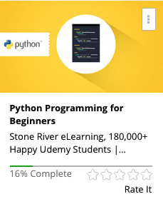

```
Roberto Nogueira  BSd EE, MSd CE
Solution Integrator Experienced - Certified by Ericsson
```

# Python Programming for Beginners



**Overview**

This course includes over 26 lectures and almost 4 hours of content, designed specifically for Python programming beginners.

You will be guided through the installation process and the basic concepts of Python programming, getting to grips with the language as a whole. From there, you'll dive straight into the specifics, learning the variables, loops and statements of the language and getting to grips with the function parameters, variables and common errors.

During this course you'll have the opportunity to put your knowledge to practical use by working with files and classes, importing syntax and making modules, and most importantly, by building your own Python program from scratch.

You'll walk away with detailed knowledge of one of the most widely used programming languages in the world. You'll have gained a foundation of skills that will enable you to progress to more complex coding languages, as well as understanding the underlying principles of all programming languages. In short, you'll have everything you need to become a proficient programmer.

## Contents

```
Section: 1 Getting Started with Python
[ ] 1. Installation 9:31
[ ] 2.Print and Strings 7:47
[ ] 3. Math 2:46

Section: 2 Variables, Loops and Statements
[ ] 4. Variables 4:49
[ ] 5. While Loops 6:00
[ ] 6. For Loops 5:00
[ ] 7. If Statements 6:43
[ ] 8. If Else Statements 4:01
[ ] 9. If Elif Else Statements 10:21

Section: 3 Functions and Variables
[ ] 10. Functions 5:03
[ ] 11. Function Parameters 14:04
[ ] 12. Global and Local Variables 9:13

Section: 4 Understanding Error Detection
[ ] 13. Common Python Errors 11:35

Section: 5 Working with Files and Classes
[ ] 14. Writing to a File 4:29
[ ] 15. Appending to a File 3:23
[ ] 16. Reading From a File 3:34
[ ] 17. Classes 4:23

Section: 6 Intermediate Python
[ ] 18. Input and Statistics 7:22
[ ] 19. Import Syntax 6:38
[ ] 20. Making Modules 6:20
[ ] 21. Error Handling - Try and Except 13:10
[ ] 22. Lists vs. Tuples and List Manipulation 10:34
[ ] 23. Dictionaries 8:14

Section: 7 Final Project
[ ] 24. Final Project 0:00
[ ] 25. Final Project Solution 26:15
[ ] 26. Request a Course 0:00
```
